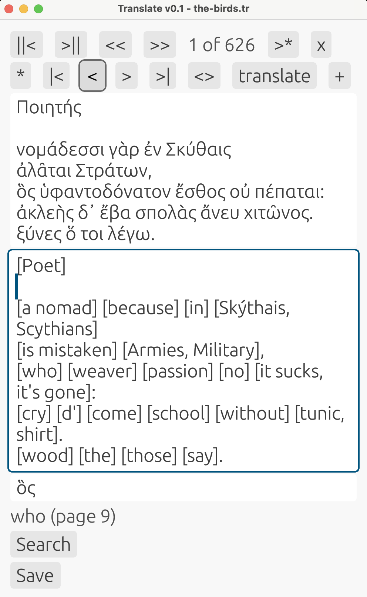
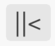
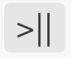
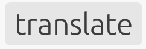

# Translate
A tool for translation or reading ancient texts in their original language



To install:

```text
cargo install advancedresearch-translate --example translate
```

To run:

```text
translate "my-translation.tr"
```

### Introduction to Translate

Translate assists in translation of ancient texts by letting the translator make personal notes per word and use automatic word-for-word translation based on the definitions chosen by the translator.

The tool is language-agnostic and stores the data in a JSON compatible data format, using a simple syntax defined by the [Piston-Meta](https://crates.io/crates/piston_meta) format.

A document stores both the original text, the translation and word definitions in a flat data structure.
Word definitions can be put in any order relative to the original text.
For quick navigation, one can move to the next paragraph or page, skipping word definitions.

### How to use Translate

|Button|Description|Comment|
|----|-----|----|
||Previous page|Skips word definitions|
||Next page|Skips word definitions|
||Jump back 100|Includes word definitions|
||Jump forward 100|Includes word definitions|
||Item index|Includes word definitions|
||Insert after current item|Increases index of later items|
||Delete item|Decreases index of later items|
||Add item|Adds new item at the end|
||Move to first item|Includes word definitions|
||Move to previous item|Includes word definitions|
||Move to next item|Includes word definitions|
||Move to last item|Includes word definitions|
||Swap items|Swaps previous item with current item|
||Translate|Translates paragraph/page word-for-word using word definitions in brackets `[]`|
||Extend word definitions|Inserts missing word definitions after current page/paragraph|

### Motivation

Texts written in ancient languages can be difficult to understand.
When studying these texts, relying on translations only, might be insufficient for research.

Learning how to read in an ancient language can take a lot of time and might require years of training.
When using AI tools, they might have been trained on public data that is biased toward particular interpretations that might give different meanings to the same words in ancient texts.
This makes translation of ancient texts very difficult and error-prone.

AI tools usually do not show alternative interpretations of a word directly, or where this word is used in the ancient literature.
On the other hand, when using an academic dictionary, there is often too much information per word to make a sentence easily comprehensible.
Authors of texts tend to use particular meaning of words, but this can also be confusing if the text was altered by different people over time.

This means that when translating, the translator needs to have the options to make personal notes per word and to pick out particular interpretations from a dictionary.
The user interface and data format of Translate allows great flexibility, yet at the same time does not get in the way of work.
